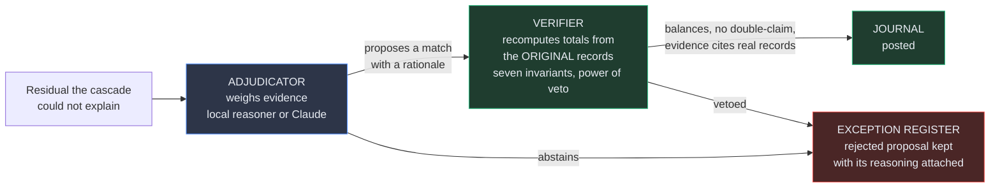
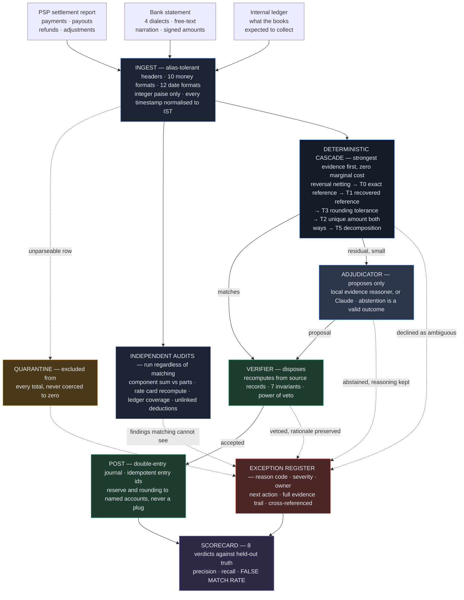
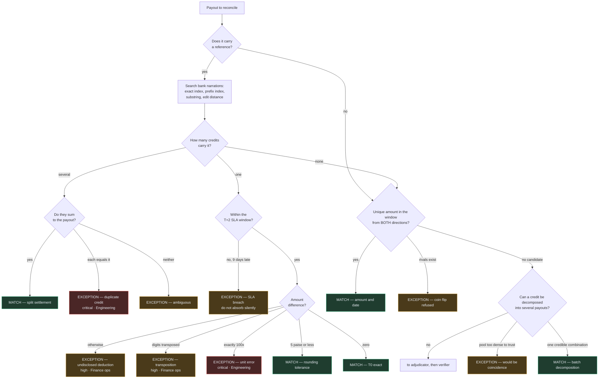

# finctl — an AI finance controller that refuses to guess

**Autonomous three-way settlement reconciliation.** PSP payout report ↔ bank
statement ↔ internal ledger, closed end to end: matched, verified, posted to a
balanced double-entry journal, with everything it could not resolve on an
exception register that names a reason, an owner, and a next action.

Built for **Razorpay Track 04 — AI Finance Controller**.

**Engine:** pure Python standard library, no runtime dependencies, 127 tests.
**Agent:** a tool-using LLM that investigates the residual the deterministic
cascade cannot explain — and is overruled by arithmetic when it is wrong.
**Dashboard:** React 19 + TypeScript + Tailwind CSS 4, built with Vite — and
the build is committed, so running it still needs nothing but Python.

---

## Table of contents

1. [The problem](#1-the-problem)
2. [What finctl does](#2-what-finctl-does)
3. [Quickstart](#3-quickstart)
4. [Results](#4-results)
5. [Why this approach](#5-why-this-approach)
6. [Architecture](#6-architecture)
7. [Worked examples from the real run](#7-worked-examples-from-the-real-run)
8. [Pros and cons of this architecture](#8-pros-and-cons-of-this-architecture)
9. [The edge-case catalogue](#9-the-edge-case-catalogue)
10. [Calibration: the one deliberate trade](#10-calibration-the-one-deliberate-trade)
11. [Design decisions worth defending](#11-design-decisions-worth-defending)
12. [Honest limitations](#12-honest-limitations)

---

## 1. The problem

### What settlement reconciliation actually is

A business takes card and UPI payments through a gateway. The gateway does not
forward each payment individually — it batches them, deducts its commission and
GST on that commission, nets off any refunds and chargebacks, and wires the
remainder to the bank account a day or two later.

So on Tuesday the bank shows a single credit of **₹83,682.11**, with a narration
like `RTGS CONSOLIDATED PAYOUT RAZORPAY 5 BATCHES`.

Somebody has to answer: *which* payments is that? Is it the right amount? Was
the commission correct? Did every payment we captured actually arrive?

That question has to be answered for every credit, every day, before the books
can close.

### Why it is genuinely hard

It looks like a lookup and it is not. The problems compound:

| | |
|---|---|
| **The identifier usually survives — usually** | The UTR is the join key, buried in free-text narration. But bank exports clip narration at a fixed field width, mid-reference. Portals re-key references and transpose characters. Every bank formats it differently. |
| **One credit is many payouts** | Five settlements netted into one transfer. Recovering which five is subset-sum. |
| **One payout is many credits** | A large payout crosses an RTGS batch limit and arrives as two transfers. |
| **The amounts do not match by design** | Gross minus commission minus 18% GST *on that commission*, rounded twice. A one-paise disagreement between two systems is normal. A ₹75,000 shortfall is not. Telling them apart is the job. |
| **Dates lie** | "T+2" means two *banking* days. Friday settles Tuesday. A payout spanning Diwali slips further. A payment captured at 23:45 UTC happened *the next day* in IST, and bucketing it on the UTC date puts it in the wrong batch permanently. |
| **Some of it is genuinely undecidable** | Two payouts of exactly ₹81,360.73 on the same day, neither carrying a reference, and one credit. No amount of cleverness resolves that. |
| **The dangerous errors are silent** | A paise/rupee unit slip makes a figure 100× wrong. Two transposed digits turn ₹6,53,096.90 into ₹6,35,096.90. Both reconcile *almost* correctly, which is how they survive. |

### The real-world cost

This is done by hand, in a spreadsheet, at essentially every company using a
payment gateway. The consequences of doing it badly are not abstract:

- **Revenue collected but never booked.** Money arrives, no ledger entry exists,
  and it is invisible at year end.
- **Overcharges nobody notices.** An overcharged payment still settles and still
  reconciles — both sides agree on the wrong number. Only independently
  recomputing the fee against the contracted rate card finds it. In the sample
  batch that is **₹4,505.27** of recoverable money in a single month.
- **Double-posted credits.** The same UTR credited twice overstates cash by the
  full payout amount.
- **Money quietly withheld.** The gateway retains part of a payout as a reserve.
  The credit matches the payout exactly, so matching alone can never see it —
  only comparing the payout against its component payments reveals the gap.
- **Silent SLA breaches.** Right reference, right amount, nine banking days
  late. Match it silently and a contract problem never surfaces.
- **The month-end scramble.** Books cannot close until every break is explained,
  and the breaks are found on the last day.

### The bar this track sets

> *Throughput plus measured accuracy plus an honest exception list. One
> cherry-picked match proves nothing.*

And:

> *The 2026 builder consensus: verification capacity, not generation speed, is
> the bottleneck.*

Taken literally, that second line is the design brief. **The interesting
engineering is not in producing answers. It is in being able to reject them.**

---

## 2. What finctl does

It closes one finance-ops loop completely.

For every bank credit, it must prove:

```
credit  =  Σ(gross payments)  −  fees  −  GST  −  refunds  −  chargebacks  −  adjustments
```

If it can prove that, the match is verified against the source records and
posted to a double-entry journal. If it cannot, the record goes onto an
exception register with a reason code, a severity, the team that owns it, a
suggested next action, and the full evidence trail of what was considered and
rejected.

It reconciles **three** sources, not two, because two-way reconciliation cannot
see the failures that matter most:

- **PSP ↔ Bank** — did the money the gateway says it sent actually arrive?
- **PSP ↔ Payments** — does the payout equal the sum of its parts? *(catches
  reserves and undisclosed deductions)*
- **PSP ↔ Rate card** — was the commission correct? *(catches overcharges)*
- **Payments ↔ Ledger** — did we book what we collected? *(catches unrecorded
  revenue)*

---

## 3. Quickstart

Python 3.11+ and nothing else. The dashboard ships pre-built, so there is no
`npm install` between a clone and a running demo.

```bash
python -m datagen.generate --cases 900 --out data
```

```bash
python -m finctl recon --data data
```

```bash
python -m finctl serve --data data --port 8000
```

The third opens the dashboard at `http://127.0.0.1:8000` — match funnel,
accuracy scorecard, a daily reconciliation chart, the exception register with
drill-down evidence trails, the journal, and the edge-case catalogue. It is
responsive down to a phone, has light and dark themes, and is keyboard-driven
(<kbd>/</kbd> search, <kbd>J</kbd>/<kbd>K</kbd> move, <kbd>1</kbd>–<kbd>5</kbd>
switch tab, <kbd>T</kbd> theme, <kbd>R</kbd> re-run).

```bash
python -m unittest discover -s tests -t .
```

Other commands:

```bash
python -m finctl exceptions --data data --severity high
```

```bash
python -m finctl journal --data data
```

### Working on the frontend

Only needed if you are changing the UI:

```bash
cd web && npm install && npm run dev
```

Vite serves on `:5173` with hot reload and proxies `/api` to the Python server
on `:8000`, so run `python -m finctl serve` alongside it. When you are done:

```bash
cd web && npm run build
```

That refreshes `web/dist`, which is committed — see
[§6.6](#66-the-frontend).

---

## 4. Results

Measured on the shipped 900-case batch (`--seed 20260828`), against **held-out
labels the engine never sees**. The generator writes `truth.json` alongside the
CSVs; the loader's manifest deliberately excludes it.

| | |
|---|---|
| **Throughput** | 5,320 records in 0.60s — **~8,800 records/second** |
| **Match rate** | 75.7% of payouts closed automatically |
| **Overall accuracy** | 96.3% |
| **Match precision** | **100.0%** |
| **Exception recall** | **100.0%** — every planted break was caught |
| **Reason-code accuracy** | **100.0%** — right record *and* right reason |
| **False match rate** | **0.000%** across 9 independent batches up to 29,526 records |
| **Ledger** | Balanced. 730 entries, debits = credits, every run. |

### Where the work went

| Tier | Mechanism | Matches | Share |
|---|---|---|---|
| T0 | Exact reference in the narration | 510 | 68.4% |
| T1 | Reference recovered — truncated, transposed | 61 | 8.2% |
| T2 | Unique amount and date, checked both directions | 91 | 12.2% |
| T3 | Within rounding tolerance (5 paise) | 35 | 4.7% |
| T5 | Batch decomposition and splits | 49 | 6.6% |
| T7 | Adjudicated | 0 | It abstained on all 177 it saw — the correct answer for them |

**88.7% of matches came from the three cheapest tiers.** That is the cascade
working as designed: the expensive machinery only ever sees a small residual.

### The number that matters

Match rate is trivially gameable — match everything and it hits 100%. The metric
this project optimises is the **false match rate**: how often the system
confidently paired records that do not belong together, or claimed to resolve
something the data cannot resolve.

It is **zero**, and it stays zero when a deliberately reckless reasoning layer
is plugged in (see [§5.3](#53-the-trust-boundary)).

### What it deliberately does not do

About a fifth of the batch is **unresolvable by construction** — two identical
payouts with no reference, a chargeback for a payment outside the period, a
credit no settlement explains. An engine scoring 100% auto-resolution on this
data would be lying. The ceiling is ~81%; the engine reaches 76.9%.

**The match rate is 75.7% and that is the honest number.** The gap is almost
entirely multi-way batch decomposition, refused on purpose — see
[§10](#10-calibration-the-one-deliberate-trade).

> An earlier build of this system reported a **90.6%** match rate on the same
> data. It was also producing false matches at volume. The lower number is the
> better system, and being able to tell those two builds apart is the entire
> point of measuring against labels.

---

## 5. Why this approach

### 5.1 Why not just ask a model to match the CSVs?

The obvious approach is to feed both files to an LLM and ask which rows
correspond. It fails on all three judging criteria at once:

- **Throughput.** 5,300 records is far past what fits usefully in one context,
  and per-record calls cost real money and seconds at 30,000 records.
- **Accuracy.** A language model doing arithmetic on crores of paise across
  hundreds of rows will produce plausible, confident, wrong sums. Reconciliation
  is not a task where "usually right" is a useful property.
- **Honesty.** A model asked "which of these is the match?" will answer. It has
  no mechanism to say *"two of these are equally likely and choosing is a coin
  flip"* — which is the correct answer surprisingly often.

The deeper problem: an LLM's failure mode here is **invisible**. A wrong match
looks exactly like a right one in the output. It raises the match rate, which
makes the system look *better* while making it worse.

### 5.2 The cascade: strongest evidence first, cheapest first

Reconciliation is overwhelmingly a solved problem *per record* — it is only hard
in aggregate, because the hard cases hide among the easy ones. So the engine
runs a sequence of passes ordered by evidential strength, each seeing only what
the previous one could not explain.

This is a **correctness** property, not just a performance one:

> Running a weak matcher before a strong one lets it claim records the strong
> one would have matched correctly. Those false matches are invisible, because
> the match rate goes **up**.

An amount-only matcher run first will happily pair a credit with the wrong
payout of equal value, stealing it from the payout whose UTR was right there in
the narration. Strongest-first is what makes the accuracy number real.

### 5.3 The trust boundary

**The adjudicator proposes. It does not decide.**



The verifier **recomputes every total from the source records** rather than
trusting what a match says about itself — a check that reuses the calculation it
is checking is not a check. It shares no code with the matching passes.

Seven invariants, all with veto power:

| Invariant | What it prevents |
|---|---|
| `balances` | A match whose two sides differ beyond tolerance |
| `no_double_claim` | One credit satisfying two payouts |
| `records_exist` | A match citing an ID that was never in the batch |
| `has_evidence` | A match asserted without a supporting fact naming real records |
| `credits_only` | A payout "arriving" as a debit |
| `date_plausible` | A credit matched to a payout months away |
| `confidence_sane` | A confidence outside [0, 1] |

**This is tested adversarially.** `tests/test_guardrails.py` contains
`RecklessAdjudicator` — a reasoning layer that confidently matches the first
candidate it is offered, every time, at maximum confidence, with a
plausible-sounding rationale:

> *"The value date aligns with the settlement cycle and the narration is
> consistent with a gateway payout, so this is the corresponding credit."*

That is the failure mode that matters — not a model that errors, but one that is
confidently and articulately wrong. The tests assert that it **does** make
proposals, that the verifier overrules them, that no unbalanced match reaches
the ledger, that the journal still balances, and that **the false match rate
stays at zero**.

That is the whole thesis, executable.

### 5.4 Ambiguity is a result, not a failure

Every pass may decline. Two payouts of identical value on the same day with no
reference is genuinely undecidable, and the system says so rather than flipping
a coin.

This is a product decision as much as an engineering one: **a wrong match costs
an operator more than no match.** An unmatched item sits on a worklist. A wrongly
matched item is invisible until someone finds it, and by then it has been posted
to the ledger.

---

## 6. Architecture

### 6.1 System overview



### 6.2 The matching decision, per payout



### 6.3 Module map

```
datagen/
  scenarios.py      30-scenario catalogue: name, weight, correct outcome, difficulty
  generate.py       seeded world builder; 4 bank dialects; writes held-out truth.json

finctl/
  money.py          integer paise, never a float. 10 input formats, Indian grouping,
                    scale-error and transposition detection
  timeutil.py       IST normalisation, banking days, RBI holidays, T+N windows
  models.py         frozen records; the reason-code taxonomy with severity,
                    owning team and suggested action per code

  ingest/loader.py  alias-tolerant headers; balance check on every payment;
                    quarantine instead of coercion

  engine/
    feemodel.py     rate card forward, fee verification, and net to gross inversion
                    returning EVERY pre-image so ambiguity is never hidden
    narration.py    reference recovery: shape scoring, then exact / truncated /
                    bounded Damerau-Levenshtein, as separate stages
    subsetsum.py    meet-in-the-middle + branch-and-bound, plus the credibility
                    machinery that decides whether a sum is evidence at all
    index.py        three-way candidate generation; bounds the candidate pool
    reconcile.py    the cascade and the audits

  adjudicate/
    offline.py      transparent weighted-evidence reasoner with a margin rule
    tools.py        the read-only investigation toolbox handed to the agent
    agent.py        tool-using agent, OpenAI-compatible, stdlib HTTP
    claude.py       Anthropic Messages API on the same interface

  verify/invariants.py   independent recomputation with veto power
  post/journal.py        double-entry, idempotent, balanced, no suspense plugs
  report/scorecard.py    8 verdicts, precision/recall, per-scenario slice
  pipeline.py            the one path CLI, dashboard and tests all share
  cli.py                 recon / exceptions / journal / serve

server/app.py       API + static host: stdlib http.server, no framework

web/                the dashboard - React 19, TypeScript, Tailwind 4, Vite
  src/types.ts      the API contract, mirrored from the Python payloads
  src/lib/api.ts    typed fetch layer, one function per endpoint
  src/hooks/        theme, aborting fetch, media query, debounce
  src/components/   AppBar, KpiRow, DailyChart, primitives, Toast
  src/views/        Overview, Exceptions, Matches, Journal, Scenarios
  dist/             COMMITTED build output - see below

tests/              127 tests, including the API/UI seam and agent containment
```

### 6.5 The agent

The deterministic cascade explains 88.7% of matches at no marginal cost. What
survives it is genuinely hard, and that is where the agent works.

It is a **tool-using agent**, not a classifier with a prompt. Given one
unresolved payout and a fixed candidate set, it decides what to look at next:

```
get_credit          the full bank narration for a candidate
score_reference     does the payout's reference appear in that narration?
explain_gap         is the amount difference rounding, a 100x unit bug, or
                    transposed digits?
payout_components   do the payments behind this payout sum to it?
invert_fee          could this net have come from a real payment?
list_credits_near   what else sits in this window?
check_contested     does ANOTHER payout fit this credit equally well?
```

Those are the cascade's own primitives. The agent gets no new powers, only the
freedom to combine them in an order no fixed pass would — and the sequence it
chooses is recorded as the evidence trail for its decision.

Run it with:

```bash
python -m finctl recon --data data --adjudicator agent
```

Written against the **OpenAI-compatible** schema over stdlib `urllib`, so one
adapter serves Groq (default), Gemini's compatibility endpoint, OpenAI or a
local server. Set `GROQ_API_KEY` in `.env`; without a key the run degrades to
the offline reasoner rather than failing.

#### Containment

The agent sits *outside* the trust boundary, so every way it can go wrong lands
somewhere safe:

| Failure | Result |
|---|---|
| Names an id it was never offered | Discarded as fabrication, before the verifier sees it |
| Replies in prose without deciding | Not a decision, so not treated as one |
| Investigates forever | Abstains after a turn cap |
| Transport error, timeout, rate limit | Abstains; a failure can never become a match |
| Confidently wrong | Verifier recomputes from source and vetoes |

It never sees raw paise and never does arithmetic — tools return formatted
amounts and pre-classified gaps. It is asked to weigh evidence, which it is good
at, not to add up crores, which it is not.

#### What `check_contested` fixed

The first live run exposed a real gap. Handed a payout with no reference, the
agent found a credit matching on amount *and* date and matched it at 0.99
confidence. Reasonable-looking — and wrong, because a second payout of identical
value also fitted that credit. The agent had no way to know: mutual uniqueness
is a fact about the *payout* side, and every tool it had looked at credits.

That was a missing instrument, not a bad model. With `check_contested` added,
the same case now returns:

> *"The only exact amount/date candidate is contested: another payout
> (setl_000844) matches the same credit equally well, and there is no reference
> to distinguish them. Hence we cannot uniquely identify the credit."*

Declining. Which is correct.

#### Measured, on this dataset

A full run with the agent enabled, Groq serving `openai/gpt-oss-120b`:

| | |
|---|---|
| Cases investigated | 7 |
| Tool calls | 25 — **3.6 per case**, sequence chosen by the agent |
| Matched | **0** |
| Declined | **7** |
| Failed (degraded to abstention) | 1 |
| Wall time | 211.7s for the agent tier |
| Tokens | 48,647 in / 6,074 out over 32 requests |
| **False match rate** | **0.000%** — unchanged with a live LLM in the loop |

**The agent resolved nothing, and that is the correct answer here.** By the time
a case reaches it, the deterministic cascade has taken everything it can
justify. What is left on this dataset is dominated by components of batched
credits with no reference on either side — genuinely undecidable by picking one
credit, which is exactly what the agent kept concluding.

Two honest consequences:

- **It costs 211 seconds and buys no extra matches on this data.** That is the
  real trade, and `--adjudicator local` remains the default because of it. On
  production data carrying payout references the residual is both smaller and
  far more decidable, which is where an investigating agent earns its latency.
- **The accuracy figures are identical to the deterministic run** — 96.3%
  accuracy, 100% precision, 100% exception recall. The agent neither helped nor
  harmed, which is the strongest available evidence that the containment works:
  a real language model, given real tools, moved the correctness needle by
  exactly zero in either direction.

Latency is dominated by the free tier's 8,000 tokens-per-minute limit, not by
the model — the adapter backs off on the provider's own retry hint and reports
how often it was throttled.

#### Determinism

This tier is explicitly non-deterministic, unlike the rest of the engine.
Temperature is pinned to zero and the full tool trace is recorded, so a decision
is *auditable* even where it is not bit-reproducible. `--adjudicator local`
remains the default and keeps the whole run deterministic.

### 6.6 The frontend

The dashboard is a React 19 + TypeScript + Tailwind 4 single-page app built
with Vite. **The production build is committed to the repository**, and that is
the design decision worth explaining.

A modern frontend toolchain and a zero-install demo usually pull in opposite
directions: React needs Node, `npm install`, and a build step, while the whole
premise of this project is that someone can clone it and run it with nothing
but Python. Committing `web/dist` resolves the tension rather than picking a
side. Developers get the full toolchain with hot reload; a reviewer gets a
working dashboard from `python -m finctl serve` and never learns that Node was
involved.

The cost is a build artefact in version control, which is normally a smell.
Here it is a deliberate distribution choice, and `tests/test_server.py` guards
it: one test asserts the build exists, another parses the served HTML and
fetches every asset it references, so a stale or missing bundle fails the suite
instead of silently rendering a blank page.

What the frontend does with its types is the part that earns the stack.
`web/src/types.ts` mirrors the Python payload builders exactly, so a field
renamed on the server surfaces as a compile error in every component that read
it. TypeScript can only check the shape it was told about, though, so the
runtime half is asserted from the Python side: `TestApiContract` walks every
field the types declare and fails if the server stops sending one.

Notes on the smaller choices:

- **No charting library.** The daily chart and every bar are hand-drawn SVG.
  The shapes are simple, and drawing them directly means they read theme tokens
  as CSS variables and re-colour instantly on a theme flip, with no chart-level
  theme config to keep in sync.
- **No state or data-fetching library.** Every request is a plain GET against a
  batch that only changes on an explicit re-run, so caching machinery would be
  weight without a job. What does matter is aborting in-flight requests, since
  filters change on every keystroke and a stale response landing after a newer
  one would show the wrong rows -- so that is what the fetch hook actually does.
- **No web fonts.** A dashboard that needs the network to look right would
  undercut the offline premise, so it uses the system font stack.
- **Semantic colour tokens.** Every colour is defined twice, once per theme,
  and Tailwind's theme points at the variable rather than the literal. Nothing
  in the components knows which theme is active.

### 6.4 Two details that carry disproportionate weight

**Candidate generation (`index.py`).** Naive matching is quadratic: every payout
against every credit. At 1,056 payouts and 913 credits that is a million
narration parses, growing as the square of merchant volume. Three indexes —
exact reference, reference prefix, and date window — reduce it to "which handful
of credits could possibly relate to this payout?" Expensive fuzzy comparison
runs only over that union, and only when the cheap lookups found nothing at all.
That single ordering change cut the identifier pass from 1,102 ms to 174 ms.

**Fee inversion (`feemodel.py`).** Given only a net bank credit, what gross
produced it? The rate card rounds twice — once on commission, again on GST — so
the mapping is not injective: several adjacent gross amounts can produce the
same net. The function returns **every** valid pre-image. Across 3,000 random
amounts it recovered the true gross every time — uniquely in 94.6% of cases, and
as an honest multi-valued answer in the rest. Returning "the" answer there would
have been a quiet lie.

---

## 7. Worked examples from the real run

Every example below is copied from an actual run against `data/` — real IDs,
real amounts, real evidence strings.

### 7.1 The easy case (T0 — 68% of matches)

```
PAYOUT  setl_000004    ₹8,513.00   2026-11-09   utr=AXISP74659198193
CREDIT  bank_000006    ₹8,513.00   2026-11-09
        narration: BY TRANSFER-NEFT*AXIS0008058*AXISP74659198193*RAZORPAY SOFTWARE

EVIDENCE  settlement UTR AXISP74659198193 recovered from narration by
          exact_substring (score 1.00)
RESIDUAL  0 paise
```

Note the date: 2026-11-09. The payment was captured on 5 November; T+2 crossed
**Diwali on the 8th**, a Sunday. A calendar-day window would have looked on the
7th and found nothing.

### 7.2 Narration clipped mid-reference (T1)

The bank truncated the narration at its field width, leaving 13 of 16 characters:

```
PAYOUT  setl_000051      ₹732.00   2026-07-28   utr=HDFCN38186895508
CREDIT  bank_000053      ₹732.00   2026-07-28
        narration: NEFT-HDFCN38186895          <- clipped

EVIDENCE  recovered by truncated_prefix (score 0.80) as HDFCN38186895
```

Truncation is treated as its own named mechanism rather than a weak partial
match, because a long shared prefix is genuinely strong evidence — while a
*short* one is coincidence, so the threshold is on absolute length.

### 7.3 A one-paise disagreement (T3)

```
PAYOUT  setl_000154      ₹167.21   2026-07-22   utr=AXISP32473055984
CREDIT  bank_000156      ₹167.22   2026-07-22

EVIDENCE  reference matched exactly (score 1.00)
EVIDENCE  +1 paise difference, within the 5 paise tolerance
RATIONALE Reference matches and the 1 paise difference is consistent with the
          two sides rounding a fee split differently.
```

Five paise is the **only** place the system is permitted to call two different
numbers equal. Anything wider starts absorbing real shortfalls — see 7.6.

### 7.4 One credit, five payouts (T5 — subset-sum)

```
CREDIT  bank_000738   ₹83,682.11   2026-07-10
        narration: RTGS CONSOLIDATED PAYOUT RAZORPAY 5 BATCHES

recovered components (none carries a reference):
        setl_000717    ₹6,723.49
        setl_000723    ₹7,240.01
        setl_000728      ₹386.65
        ... 2 more

EVIDENCE  5 of the 14 payouts in this window total ₹83,682.11, the only
          combination that reaches the credit
RATIONALE Of every combination of up to 6 payouts in the window, exactly one
          reaches this total, so the decomposition is forced rather than chosen.
```

"Forced rather than chosen" is the load-bearing phrase. If **two** combinations
had reached the total, it would have refused — see
[§10](#10-calibration-the-one-deliberate-trade).

### 7.5 One payout, two credits (split settlement)

```
PAYOUT  setl_000775   ₹2,49,981.66   2026-07-17   utr=HDFCN24533003862
CREDIT  bank_000778   ₹1,24,990.83   RTGS-HDFCN24533003862-RAZORPAY PART 1 OF 2
CREDIT  bank_000779   ₹1,24,990.83   RTGS-HDFCN24533003862-RAZORPAY PART 2 OF 2

EVIDENCE  the parts sum to the payout:
          ₹1,24,990.83 + ₹1,24,990.83 = ₹2,49,981.66
```

Two credits carrying one reference has three possible meanings — a split, a
double-post, or something else. The engine distinguishes them arithmetically,
and 7.7 is the same shape with the opposite answer.

### 7.6 An undisclosed deduction (exception)

```
PAYOUT  setl_005714   ₹3,99,137.96   2026-07-06   utr=ICICR47708055775
CREDIT  bank_005718   ₹3,23,548.07   same reference, same date

SUMMARY   Credit is ₹75,589.89 short of the payout, with no refund or
          adjustment on file to account for it
SEVERITY  high
OWNER     Finance ops -> compare against the PSP dashboard; likely an
          undisclosed deduction
```

The reference matches perfectly. A reference-only matcher marks this reconciled
and loses ₹75,589.89 silently.

### 7.7 The same reference, credited twice (critical)

```
CREDIT  bank_005387   ₹5,07,544.44   2026-07-22
CREDIT  bank_005388   ₹5,07,544.44   2026-07-22
        both: NEFT-HDFCN36749847661-RAZORPAY SOFTWARE PRIVATE LIMITED-360885618

SUMMARY   The same reference credited 2 times for the full payout amount.
          ₹5,07,544.44 appears to be a double-post.
EVIDENCE  each of the 2 lines equals the full payout; the account was credited
          ₹10,15,088.88 in total
SEVERITY  critical
OWNER     Engineering -> check the ingest pipeline for replay; do not settle
          until resolved
```

### 7.8 A paise/rupee unit slip (critical)

```
PAYOUT  setl_000910   ₹4,34,156.00   2026-07-29
CREDIT  bank_000914     ₹4,341.56    same reference, same date

SUMMARY   Bank line reads ₹4,341.56 against a payout of ₹4,34,156.00 —
          a factor of exactly 100
OWNER     Engineering -> audit the currency unit on the feed that produced
          this record
```

Not "amount mismatch". Naming the *signature* of the error routes it to the team
that can fix the integration rather than to a finance analyst who will spend an
afternoon on it.

### 7.9 Transposed digits (high)

```
PAYOUT  setl_006372   ₹6,53,096.90   utr=SBINR84457809212
CREDIT  bank_006375   ₹6,35,096.90   same reference

SUMMARY   ₹6,35,096.90 and ₹6,53,096.90 use the same digits in a different order
OWNER     Finance ops -> verify against source document before correcting
          either side
```

Detected by the accountant's divisible-by-nine check, then **confirmed against
an actual digit multiset comparison** — the /9 rule alone produces far too many
false positives to route on.

### 7.10 Genuinely undecidable (the honest refusal)

```
PAYOUT  setl_003611   ₹81,360.73   2026-07-03   utr=None
PAYOUT  setl_003615   ₹81,360.73   2026-07-03   utr=None
CREDIT  bank_003617   ₹81,360.73   2026-07-03

SUMMARY   2 payouts of identical value fall in the same window with no
          reference on any of them. Matching would be a coin flip.
OWNER     Finance ops -> pick using the payer narration or ask the PSP for
          the UTR breakdown
```

**This is the single most important behaviour in the system.** Every matcher
that reports a high match rate is quietly resolving cases like this one.

### 7.11 An SLA breach hiding inside a perfect match

```
PAYOUT  setl_002265   ₹6,35,946.21   2026-07-09
CREDIT  bank_002268   ₹6,35,946.21   2026-07-22   same reference, exact amount

SUMMARY   Reference and amount agree, but the credit arrived 9 banking days
          late — outside the T+2 settlement SLA
```

Identical amount, correct reference. It *is* the right money. Matching it
silently is what buries a contract problem, so beyond a bounded window a correct
reference stops being sufficient on its own.

### 7.12 An overcharge that reconciles perfectly

```
PAYMENT pay_006057   gross ₹1,91,084.60   wallet
        charged fee ₹4,490.48 + ₹687.90 GST
        rate card   ₹3,821.69 + ₹687.90 GST

SUMMARY   overcharged by ₹668.79 on wallet
OWNER     Finance -> raise with the PSP account manager; recoverable overcharge
```

The payout matched its credit exactly. Nothing in a matching-only system could
surface this — it requires independently recomputing what the fee *should* have
been.

### 7.13 Money withheld, invisible to matching

```
PAYOUT  setl_007239   ₹1,63,642.50   2026-08-03   <- matched its credit exactly

EVIDENCE  components total ₹2,51,560.03 but the payout is ₹1,63,642.50
SUMMARY   Payout is ₹87,917.53 short of the sum of its component payments net
          of documented refunds and adjustments
```

Both sides agree on the reduced figure, so two-way reconciliation sees nothing
wrong. Only the third leg — payout against its component payments — reveals
₹87,917.53 sitting at the gateway. It posts to **Gateway Reserve Receivable**,
because it is still owed, not lost.

### 7.14 Two lines that must *not* become two breaks

```
CREDIT  bank_000282    ₹94,953.33   NEFT INWARD RVSL6836503309 RAZORPAY SOFTWARE
DEBIT   bank_000283   -₹94,953.33   NEFT RETURN RVSL6836503309 BENEFICIARY
                                    ACCOUNT CLOSED

EVIDENCE  credit returned the same value date, sharing reference RVSL6836503309
```

A failed transfer. Treated independently these are two unexplained items — twice
the noise for zero information. Pairing requires a matching amount **and** a
shared reference token, so unrelated same-value transactions are never collapsed
by coincidence.

### 7.15 What actually reaches the ledger

```
JOURNAL ENTRY je_31c0588fbe78   2026-08-03
Settlement of 1 payment totalling ₹5,983.00 gross, received as ₹5,848.86
net of ₹134.14 gateway charges [utr_exact]

  Dr 1010 Bank - Current Account          ₹5,848.86
  Dr 5300 Payment Gateway Fees              ₹113.68
  Dr 1350 GST Input Credit                   ₹20.46
    Cr 1200 Trade Receivables              ₹5,983.00
```

And the trial balance for the whole run:

```
1010 Bank - Current Account           ₹9,56,60,332.97 Dr
1200 Trade Receivables               ₹10,20,85,762.37 Cr
1350 GST Input Credit                    ₹1,89,607.13 Dr
1360 Gateway Reserve Receivable          ₹6,01,277.36 Dr   <- withheld, recoverable
4900 Refunds and Chargebacks            ₹45,76,667.26 Dr
5300 Payment Gateway Fees               ₹10,57,877.56 Dr
5390 Settlement Rounding Difference              ₹0.09 Dr   <- the month's total drift
```

The whole month's rounding drift is **nine paise**, in its own named account
rather than absorbed into an expense line. Nothing is plugged to suspense.

---

## 8. Pros and cons of this architecture

Written as a genuine assessment. Every architecture trades something.

### What this design buys

**Auditability end to end.** Every match carries evidence naming the specific
records that justified it. Every exception carries what was considered and
rejected. An auditor can ask "why did you conclude that?" of any row and get a
real answer, not a confidence score.

**A reasoning layer that cannot corrupt the ledger.** Because verification is
downstream of reasoning and recomputes independently, the reasoning component
can be swapped, upgraded, or replaced with a hosted model without re-examining
the safety of the system. This is what makes the LLM path safe to adopt later.

**Cost that scales with difficulty, not volume.** 88.7% of matches cost nothing
beyond a dict lookup. On real data the expensive path would be a few percent of
records.

**Failures that are legible.** A break says *which* team owns it and *what* to
do. "Engineering: audit the currency unit on the feed" is a different work item
from "Finance ops: compare against the PSP dashboard".

**Reproducibility.** Same seed, same input, byte-identical output — including
journal entry ids, so re-running cannot double-post. An accuracy change is
attributable to a code change rather than a different roll of the dice.

**No deployment risk.** Zero dependencies means no version conflicts, no supply
chain, no `pip install` failing on a judge's laptop.

### What it costs

**Recall on the hardest scenario.** Refusing statistically unsafe decompositions
costs real matches — 22 of 59 batched credits resolve rather than all 59. The
rest become work for a human. A more permissive system would report a better
match rate and be wrong more often; I chose the former, a different business
might reasonably choose differently, and the knob (`COMBINATION_BUDGET`) is one
constant.

**A large exception register.** 367 open items on 1,056 payouts (~35%). About
160 are payouts likely belonging to an undecomposable batched credit. Each is
cross-referenced to that credit so the operator sees one situation rather than
five orphans — but it is still the weakest part of the output, and on real data
carrying payout references it would largely disappear.

**Hand-built rules, not learned ones.** The cascade encodes domain knowledge
explicitly: rate cards, banking calendars, rail formats. That makes it auditable
and correct on day one with no training data — but a new failure mode needs a
human to write a pass, where a learned system might generalise. For a system
whose output is a ledger I consider the explicitness a feature; with millions of
examples and tolerance for error, the opposite would hold.

**Throughput degrades with density.** ~8,800 rec/s at 5.3k records, ~1,800 rec/s
at 29.5k. Measured per 1,000 records, the cascade costs 7 ms at 612 records and
103 ms at 29,526 — so it is *not* near-linear. The cause is density, not volume:
the period is fixed at 31 days, so more records means denser days and larger
candidate windows, making candidate generation roughly O(n·w) with w itself
growing. The fix is the shard key — (merchant, settlement date) caps window
occupancy, and shards are embarrassingly parallel because no pass reaches across
a date window. The residual share plateaus near 24%.

**Single process.** The cascade parallelises cleanly by settlement date — the
date window is a natural shard boundary — but that was not needed at this
volume, so it is not built.

**Tuned against synthetic data.** The scenario catalogue is drawn from how Indian
settlement actually works, but it is still my model of reality. Real bank feeds
will contain dialects I have not seen. The ingest layer is built to degrade into
quarantine rather than into wrong numbers, which is the right failure mode, but
first contact with production data would find gaps.

### Alternatives considered and rejected

| Approach | Why not |
|---|---|
| **LLM reads both CSVs directly** | Cannot do reliable arithmetic at this scale; no mechanism to express "undecidable"; failures are invisible and inflate the headline metric |
| **Embedding similarity over narrations** | Reconciliation is exact arithmetic wearing a text-matching costume. Cosine similarity cannot tell ₹6,53,096.90 from ₹6,35,096.90 |
| **Train a classifier on matched pairs** | No labelled production data; would learn the biases of whatever manual process produced the labels; unauditable when it errs |
| **Rules engine with a confidence score, no verifier** | Confidence is self-reported. Without independent recomputation, a bug in a matching pass produces confidently wrong output with a high score |
| **Greedy first-match-wins** | Fast and wrong: the first plausible match steals a record from the correct one, and the error is invisible |

---

## 9. The edge-case catalogue

30 named scenarios, weighted to mirror a real merchant's mix — mostly clean with
a long tail of the awkward. **Six are unresolvable by design**, because a
generator that only produces solvable cases measures nothing: an engine that
matches everything would score 100%.

Every scenario declares the outcome a correct engine must reach *and the reason
code it must give*, which is stricter than match/no-match. Flagging the right
record for the wrong reason sends it to the wrong person, and that is most of
the cost of a break.

<details>
<summary><b>All 30 scenarios</b></summary>

**Identifier damage** — clean settlement · UTR buried in bank noise · narration
clipped mid-UTR at a 40-char field limit · transposed UTR characters · no
reference at all

**Arithmetic** — paise-level rounding drift · gross recovered by inverting the
rate card · fee charged above the contracted rate

**Batching** — 3–6 payouts netted into one credit · one payout split across two
credits

**Timing** — late but inside slack · T+2 spanning Diwali · captured 23:45 UTC
(next day in IST) · beyond the settlement SLA

**Deductions** — refund netted off · chargeback plus dispute fee · chargeback
for an out-of-period payment · refund for an out-of-period payment

**Breaks** — payout never arrived · credit from outside the PSP · undisclosed
deduction · two identical payouts with no reference · paise/rupee 100× slip ·
transposed digits · same UTR credited twice · unverifiable FX · collected but
not booked · partial settlement on hold · unparseable amount field

**Must not be raised** — credit reversed the same day, nets to zero

</details>

The generator emits **four bank dialects** with different date formats, amount
formats and narration templates. The parser is never told which is which — an
engine that only works because the generator and parser share assumptions has
proven nothing.

---

## 10. Calibration: the one deliberate trade

Batch decomposition has a failure mode that appears only at volume, and finding
it was the most interesting part of building this.

With 200 candidate payouts there are more 6-element combinations than there are
distinct sums they could make, so **some** combination lands on almost any
target. Uniqueness does not rescue it — the solution is an artefact of pool
size, not evidence about what happened.

Early builds hit **0.88% false matches at 15,000 records** from exactly this. It
looked like an accuracy *improvement* at first, because the match rate rose.

Three mechanisms fix it:

**1. Cardinality derived from pool size.** Spurious hits scale with `C(n,k)`.
Two payouts out of fifty is 1,225 combinations and a hit means something; six
out of fifty is 15.8 million and a hit means nothing. The permitted subset size
is whatever keeps the search space under a budget:

| Pool size | Largest trustworthy combination |
|---|---|
| 10 | 6 |
| 25 | 3 |
| 64 | 2 |
| 250 | refuses entirely |

**2. An empirical density probe.** Re-run the search over a much wider window
and count what lands there. If widening the tolerance from 5 paise to ₹20 turns
up thirty combinations, the region is crowded and an exact hit proves nothing.
Measuring beats modelling: I first tried an analytic estimate assuming subset
sums spread evenly, then one assuming a normal distribution, and both were wrong
by an order of magnitude because real payout sums are skewed and clumpy.

**3. A domain constraint.** A payout carrying its own reference was transferred
on its own — that reference identifies its own movement of money, so it cannot
also be a component of a different transfer. Excluding those shrinks the pool
enough to make larger decompositions trustworthy again.

The budget was **swept, not chosen**:

| Budget | Mean accuracy | False matches |
|---|---|---|
| **5,000** | **96.3%** | **0** |
| 20,000 | 97.2% | 8 |
| 60,000 | 97.7% | 5 |
| 200,000 | 97.5% | 7 |

5,000 is the only setting with zero false matches. It costs 1–3 points of
recall, and `test_recall_loss_is_confined_to_batch_decomposition` pins that loss
to the one scenario so it cannot quietly spread elsewhere.

---

## 11. Design decisions worth defending

**Money is `int` paise, everywhere.** Exactly one module is allowed to touch a
decimal string. Every float bug in a reconciler is silent — it balances in
testing and drifts in production. A test adds `0.10` a thousand times and
asserts exactly `₹100.00`.

**A bad row is quarantined, never coerced.** Defaulting a corrupt amount to zero
produces a run that balances while being wrong — the most dangerous outcome
possible here. Quarantined rows are excluded from every total and surface as
their own exception class with the original row attached.

**Uniqueness is checked from both directions.** A payout having one candidate
credit is not enough. If that credit also fits another payout equally well,
choosing either is a coin flip with a confidence score stapled to it. This is
what turns the amount-matching pass from a plausible guess into evidence.

**Reason codes carry owners.** Naming the break is most of the work; naming who
fixes it is the rest. (Writing this README surfaced a real bug here — one
guidance entry lacked its `Owner:` prefix, so the owner field swallowed the
whole sentence. There is now a test asserting every code parses to a short team
name.)

**Nothing is plugged to suspense.** A residual goes to a *named* account
depending on why it exists: rounding difference, gateway reserve receivable, or
— for a genuinely unexplained excess — suspense, counted and reported rather
than buried in a total.

**Posting is idempotent.** Entry ids derive from the match that produced them,
so re-running a period cannot double-post.

**Abstention is free.** Both adjudicators can decline, and the design treats it
as a valid result. An adjudicator that never abstains is not more capable, it is
less honest. The local reasoner requires a *margin*, not just a threshold: two
candidates at 0.81 and 0.79 mean the evidence does not distinguish them.

---

## 12. Honest limitations

- **The Claude adjudicator has never been run against the live API.** It is real
  code on the same interface, unit-tested for its parsing and rejection contract
  (malformed JSON, fenced replies, IDs not in the candidate set), and activates
  on `ANTHROPIC_API_KEY`. But no key was available for this build, and quoting
  performance numbers for it would defeat the purpose of the project.

  ```bash
  python -m finctl recon --data data --adjudicator claude
  ```

- **The rate card and holiday calendar are hardcoded** for the demo period. A
  real deployment reads both from a feed.

- **Batch decomposition is refused on high-volume days** without a payout
  reference. Real Razorpay settlement data links payments to a `settlement_id`,
  which would make this trivial — the synthetic scenario strips that link
  deliberately to exercise the hard path.

- **Ledger matching is one-to-one on `order_id`.** Partial invoice application
  and multi-invoice payments are not modelled.

- **Single process.** Parallelising by (merchant, settlement date) is
  straightforward and is also what caps the density cost described above, but it
  was not needed at this volume.

- **The exception register is large** and dominated by one scenario.
  Cross-referencing helps; a global set-partition pass over each day's credits
  and payouts (the unimplemented T6 tier) would help more.

---

*Pure-Python engine, zero runtime dependencies · React + TypeScript dashboard,
pre-built · deterministic · 105 tests · 0.000% false match rate*
